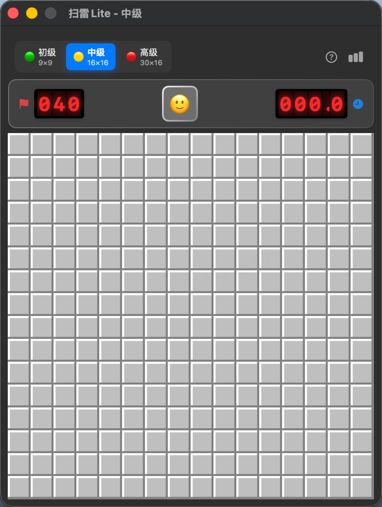

# 💣 扫雷Lite

<p align="center">
  
</p>

经典的 Windows 扫雷游戏 macOS 复刻版，使用 SwiftUI + AppKit 开发。

## ✨ 功能特性

### 🎮 游戏玩法
- ✅ 三种难度等级（初级/中级/高级）
- ✅ 左键揭开、右键标记（🚩/❓）
- ✅ 点击数字快速揭开/自动插旗
- ✅ 首次点击保证安全（3×3 区域）
- ✅ 空白区域自动展开

### ⏱️ 计时系统
- ✅ 精确到 0.1 秒
- ✅ LED 数码管显示
- ✅ 最大 999.9 秒

### 📊 数据统计
- ✅ 游戏次数、胜率、连胜/连败
- ✅ 最快时间、平均时间
- ✅ 今日/近7天/历史排行榜
- ✅ 新纪录庆祝动画
- ✅ 数据自动保存

### 🎨 界面与交互
- ✅ 经典 Windows 扫雷风格
- ✅ 笑脸按钮联动状态 + 弹跳动画
- ✅ 胜利/失败边框高亮 + 光晕效果
- ✅ 难度选择按钮带颜色指示器
- ✅ LED 数字发光效果
- ✅ 按钮悬停/按压动画
- ✅ 切换难度/游戏结束缩放动画
- ✅ 统计中心整合统计+排行榜

## ⌨️ 快捷键

| 快捷键 | 功能 |
|--------|------|
| `⌘N` / `Space` | 新游戏 |
| `⌘1` / `⌘2` / `⌘3` | 切换难度 |
| `⇧⌘S` | 统计中心 |
| `⌘?` | 帮助 |

## 🔨 编译运行

```bash
git clone https://github.com/ahusky/Minesweeper.git
cd Minesweeper
./build.sh
open build/扫雷Lite.app
```

## 💻 系统要求

- macOS 14.0+
- Swift 5.9+

## 📁 项目结构

```
Sources/
├── App/MinesweeperApp.swift       # 主程序
├── Models/
│   ├── GameModel.swift            # 游戏逻辑
│   ├── GameStatistics.swift       # 统计数据
│   └── LeaderboardManager.swift   # 排行榜
└── Views/
    ├── GameBoardView.swift        # 游戏面板
    ├── HeaderView.swift           # 顶部栏
    ├── StatsCenter.swift          # 统计中心（整合统计+排行榜）
    ├── AppColors.swift            # 主题颜色
    └── HelpView.swift             # 帮助
```

## 📜 许可证

MIT License